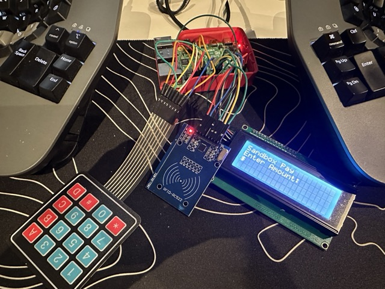
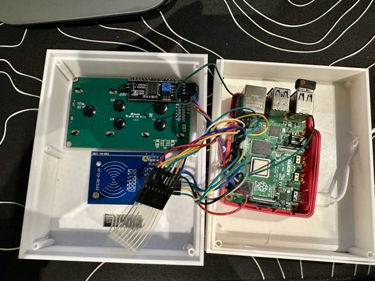
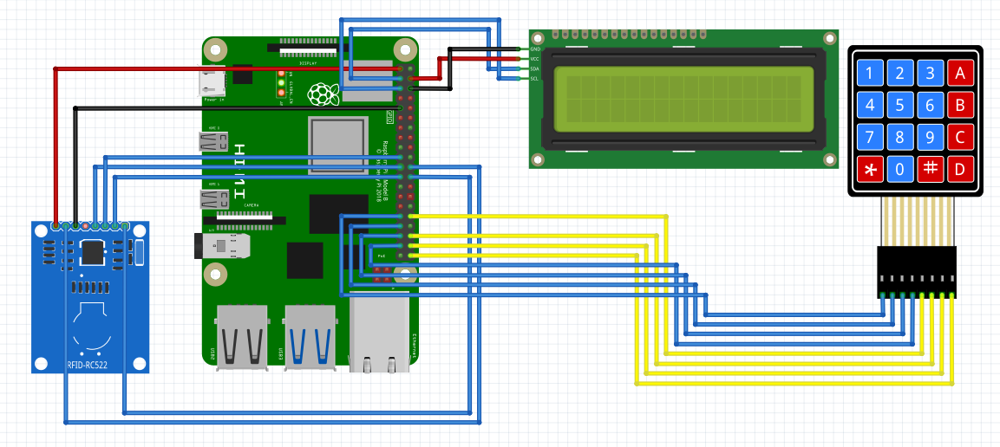

# programmable_banking_pos

## Description
This is a emulated point of sales device that can be used to perform transactions. It helps to simulate the process of a real POS device. It is programmable and can be used to test different scenarios.

This does not use any real banking system. It is just a simulation and does not perform any real transactions.

[](https://youtube.com/shorts/oQdIg1ZQI_s?feature=share)


## Hardware
The POS device has the following hardware components:
- Microcontroller: Raspberry Pi 4
- Card reader: RC522 RFID reader module
- Cards: 13.56MHZ Mifare 1K RFID cards
- Keypad: 4x4 matrix keypad
- Display: 20x4 LCD display with I2C interface





## Wiring diagram:


## Installation
For the base image on the Pi I used the Raspberry PI OS Lite image. The bookworm 64 bit version.
The python version needs to be 3.10 or higher as I have used match statements in the code.

The raspberry pi imager is the easiest way to flash the image to the SD card.
Because I want my pi to be portable and use portable wifi device. I setup the custom config to connect to that wifi network and I setup the ssh to be enabled. When developing I use the ssh over ethernet to connect to the pi which gives it network access and I dont need to use the mobile data.

Install the following packages on the Pi.
The venv is needed to create a virtual environment for the project.
The dev package is needed to install the python dev packages. The spidev package wont install without this package.
```bash
sudo apt update
sudo apt install python3-venv python3-dev
```

Configure Pi to allow i2c communication.
```bash
sudo raspi-config
```
Select `Interfacing Options` -> `I2C` -> `Yes`

Reboot the PI
```bash
sudo reboot
```

Create folder for the project
```bash
mkdir pos
cd pos
```

Setup a virtual environment and install the dependencies.
```bash
python3 -m venv env
source env/bin/activate
```

```bash
pip install -r requirements.txt
```

## Usage

```bash
python3 pos.py
```

## Cronjob
Using a cronjob to start the POS app on boot.
I have currently added a 1 minute delay to allow the network to be established before starting the POS device. Otherwise it throws an Http error.

Open the crontab file

```bash
sudo crontab -e
```
add the following line to the file
```bash
@reboot /bin/sleep 60; sh /home/devinpearson/pos/launcher.sh > /home/devinpearson/pos/logs/cronlog 2>&1
```

Create a log file for the cronjob
```bash
cd /home/devinpearson/pos
mkdir logs
```